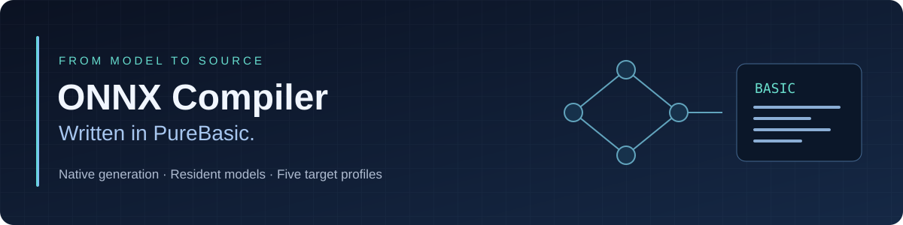

<p align="center">
  
</p>

<p align="center">
  <a href="LICENSE"></a>
  
  
  
</p>

<p align="center">
  <b>Ahead-of-time ONNX model compiler: turn supported models into readable BASIC source.</b><br>
  Native Windows applications, or bare-metal programs for Raspberry Pi 4, Arduino UNO Q, Pico and Pico 2 built with <a href="https://puremetalforge.ajtaji.com/">PureMetal Forge</a>.<br>
  Build the model application once. Keep it resident. Submit new inputs.
</p>

<p align="center">
  <b><a href="docs/GUIDE.md">📘 The ONNX Compiler Guide — the book (PDF)</a></b>
</p>

<p align="center">
  <a href="docs/QUICKSTART.md">Quick start</a> ·
  <a href="docs/BUILD.md">Build in PureBasic</a> ·
  <a href="docs/SOURCE_MAP.md">Source file guide</a> ·
  <a href="docs/TARGETS.md">Target integration</a> ·
  <a href="docs/KOKORO.md">Kokoro speech</a> ·
  <a href="examples/pi4/kokoro-sentence/README.md">Kokoro on a bare-metal Pi 4</a>
</p>

<p align="center">
  <a href="https://puremetalforge.ajtaji.com/">PureMetal Forge</a> ·
  <a href="https://forum.ajtaji.com/category/18/puremetal-forge">Forums</a> ·
  <a href="https://forum.ajtaji.com/category/123/links">Links</a>
</p>

---

## What this project does

ONNX Compiler PureBasic is a native ahead-of-time **source generator** with a
desktop interface and command-line engine. It reads the ONNX protobuf format
directly, validates a supported operator subset, prepares weights and memory,
and emits a reusable model library.

**The easiest way to get the compiler is the [PureMetal Forge download](https://puremetalforge.ajtaji.com/).**
It already includes this compiler, built and ready to run, in `PureMetalForge\tools\onnx\`:
`PureMetalOnnxCompiler.exe` (the window) and `PureMetalOnnxCompilerCLI.exe` (the
command line), with `NATIVE_COMPILER_GUIDE.txt`. No PureBasic is needed to use it.
Building from source with `Build.pb` is for people changing the compiler.

- **Windows output:** PureBasic source for a native x64 application.
- **Bare-metal output:** PureMetal BASIC source for Pi 4, UNO Q, Pico, and Pico 2.
- **No Python to build or use it:** the compiler, window, build helper and Windows examples are PureBasic. The only Python is developer tooling: the node-test harness and the Pi 4 example's host scripts.
- **No runtime graph interpreter:** generated programs execute emitted tensor calls.
- **Resident execution:** initialize once, submit new inputs, release explicitly.
- **Selectable precision:** FP32, INT8, FP16, BF16, and INT4, with explicit tradeoffs.
- **Kokoro support:** optional text/voice adapters around the full supported model.

> **Source only.** The ONNX tool writes source, a checked weight pack, and a
> manifest. It does not invoke a downstream language compiler, install a
> toolchain, upload firmware, or contact a board. `Build.pb` is a separate
> developer helper that builds this tool itself.

## Build it

**You may not need to.** The [PureMetal Forge download](https://puremetalforge.ajtaji.com/)
includes both executables ready to run: extract it and use
`PureMetalForge\tools\onnx\PureMetalOnnxCompiler.exe` (the window) or
`PureMetalOnnxCompilerCLI.exe` beside it (the command line). The same download is
the PureMetal toolchain the `pi4`, `unoq`, `pico` and `pico2` targets are built with.

A download carries the compiler as it was when that release was built. The
2026-09-14 release's copy was built on 2026-09-13, so it does not have what was
committed here after that; the [Pi 4 Kokoro sentence](examples/pi4/kokoro-sentence/README.md)
is one example that needs a newer compiler, and its recipe builds one.

Build from source when you are changing the compiler or need something newer
than your download. Verified with **PureBasic 6.21, Windows x64, native assembly backend**.

1. Clone or download this repository.
2. Open [`Build.pb`](Build.pb) in the **64-bit PureBasic IDE**.
3. Run it with **F5**. It builds the CLI and window into `bin/`.
4. Open `bin/PureMetalOnnxCompiler.exe`.

The complete build-source closure is included. PureBasic itself is a separate
prerequisite. No model, Python package, ONNX Runtime DLL, or PureMetal installation
is needed to build the generator.

Prefer building each entry point manually? See [build instructions](docs/BUILD.md).
Private product integrations can configure an ignored local release-build hook
to keep executables in their existing packaging directory; see the same guide.
Linux/macOS hosts have **not** been validated; the current GUI and Windows runtime
contain Windows-specific APIs.

## Try it without downloading a model

Run [`examples/CreateDemoModels.pb`](examples/CreateDemoModels.pb) in PureBasic.
It creates two tiny ONNX files locally using embedded model bytes:

| Demo | Operation | Purpose |
|---|---|---|
| `twice.onnx` | `y = x + x` | Changing input lengths in one resident model. |
| `dense.onnx` | `y = x × diag(2, 3)` | Fixed-shape matrix multiplication and packed weights. |

From the repository root:

```powershell
.\bin\PureMetalOnnxCompilerCLI.exe --compile output\twice.onnx --output output\twice --target windows
```

Then open [`examples/RunTwiceWindows.pb`](examples/RunTwiceWindows.pb), enable
**thread-safe executable** and **optimizer**, and run it. Three requests with
different lengths use the same initialized model and check their numerical results.

[Complete walkthrough →](docs/QUICKSTART.md)

## Targets at a glance

| Target ID | Generated source | Execution environment | Notes |
|---|---|---|---|
| `windows` | `.pb` | PureBasic x64 / Windows | CPU SIMD paths; no alternate inference engine. |
| `pi4` | `.pi4` | PureMetal / AArch64 | NEON kernels, caller-owned memory. |
| `unoq` | `.pi4` | PureMetal / AArch64 UEFI application | Same source dialect; integration belongs to the application. |
| `pico` | `.pico` | PureMetal / RP2040 Cortex-M0+ | Small models only; RAM and flash checks. |
| `pico2` | `.pico2` | PureMetal / RP2350 Cortex-M33 | Small models only; target-specific integer kernels. |

The bare-metal runtime templates are BASIC-family source stored as `.pmi`.
They are included because the PureBasic generator embeds and exports them;
they are **not** the PureMetal compiler and cannot be compiled directly by PureBasic.

[How to use generated models on targets →](docs/TARGETS.md)

## Understand the repository

```text
Build.pb                    Build the two native ONNX tools
src/                        PureBasic application entry points
  compiler/                 Parser, IR, validation, emitters, UI
runtime/                    Source embedded into generated applications
  math/                     BASIC math templates for bare-metal targets
examples/                   Model creation and a Windows consumer; pi4/ holds bare-metal Pi 4 examples
docs/                       Build, architecture, source map, targets, speech
assets/                     Repository presentation artwork
```

The [source file guide](docs/SOURCE_MAP.md) describes **every published source file** and
includes a practical “which file should I change?” table. The
[architecture guide](docs/ARCHITECTURE.md) explains the fixed and runtime-dimension paths.

## Precision and limits

**FP32** is the baseline. **INT8** uses integer kernels for eligible linear
weights with dynamic activation quantization and INT32 accumulation; other
operations retain FP32 behavior. **FP16/BF16/INT4** reduce stored weights and
decode once into budgeted resident FP32 memory. They do not promise smaller
activation buffers or native reduced-precision arithmetic.

This is an **experimental compiler for a checked subset of ONNX**, not universal
ONNX compatibility. Unsupported operators, attributes, shapes, and capacity
requirements produce errors. Runtime-dimension emission currently checks its
implemented opset-20 surface. A successful source build alone is not hardware
numerical or timing proof. See [validation and limitations](docs/VALIDATION.md).

Against the official ONNX node tests (onnx 1.22.0, the 964 cases at opset 20 or lower, Windows target) the compiler at commit `8b7d9df` passed **all 166 cases it accepted** and refused the other 798 with a sentence. The control-flow and sequence operators added since let more cases in; the ones that now stop with a sentence at run time, and a small STFT round-off, are open as [869](https://forum.ajtaji.com/topic/869) and [870](https://forum.ajtaji.com/topic/870). The harness that measures this is a developer check that building and using the compiler never need ([node-test coverage](docs/VALIDATION.md#node-test-coverage--september-16-2026), [the plan to widen it](https://forum.ajtaji.com/topic/844)).

## Optional Kokoro speech

The compiler can emit a Windows speech window or a resident Pi 4/UNO Q text
adapter for the pinned full Kokoro-82M model. The speech model remains loaded;
new text does not rebuild it. English pronunciations and voice selection are
separate from tensor inference.

**Model weights, pronunciation dictionaries, and voice packs are not included.**
They are unnecessary for building the compiler or running the arithmetic demos.
The current speech adapters require specific checked asset formats; arbitrary
raw voice files are not interchangeable. [Asset requirements and usage →](docs/KOKORO.md)

## License

[MIT](LICENSE): free use, modification, and redistribution, including commercial
use, subject to retaining the license notice. The software is provided **as is**,
without warranty, with the license's limitation-of-liability terms.

Third-party software, models, and data keep their own licenses; see
[third-party notices](THIRD_PARTY_NOTICES.md). No proprietary compiler binaries,
private keys or model data are distributed in this repository. The Python files it does carry are developer tools (the node-test harness and the Pi 4 example's host scripts), not part of the compiler.
